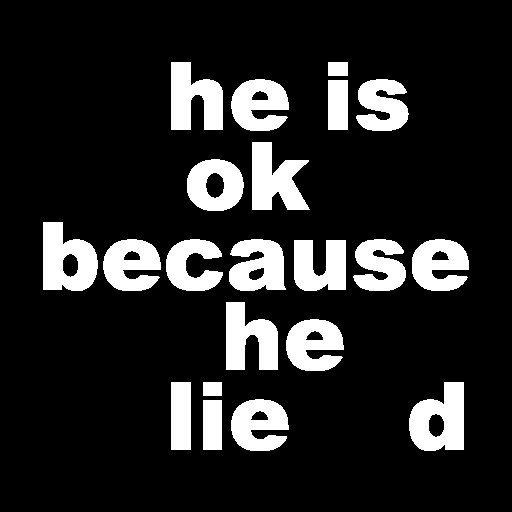
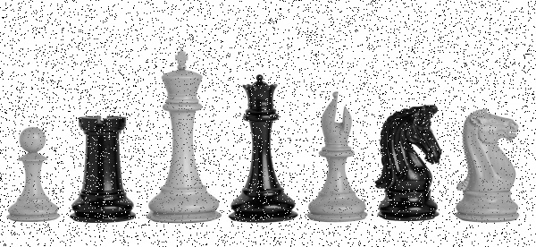

## Decoding by subtract
- find secret with subtracting 2 images.
- view:
  > 
## Black hole noise reduction
- noise reduction and stick images to create a complete black hole photo.
- view:
  > 
## Board difference
- flip an image find difference between another image.
- view:
  > 
## Hide cars  in highway
- add images to make highway looks empty!
- view:
  > 
## The Merge 
- Merging images in 4 stages.
- view:
  > 
## Image to sketch
- sketch Mona-Lisa.
- view:
  > 
## Add noise
- Add some image noises to Chess image.
- view:
  > 